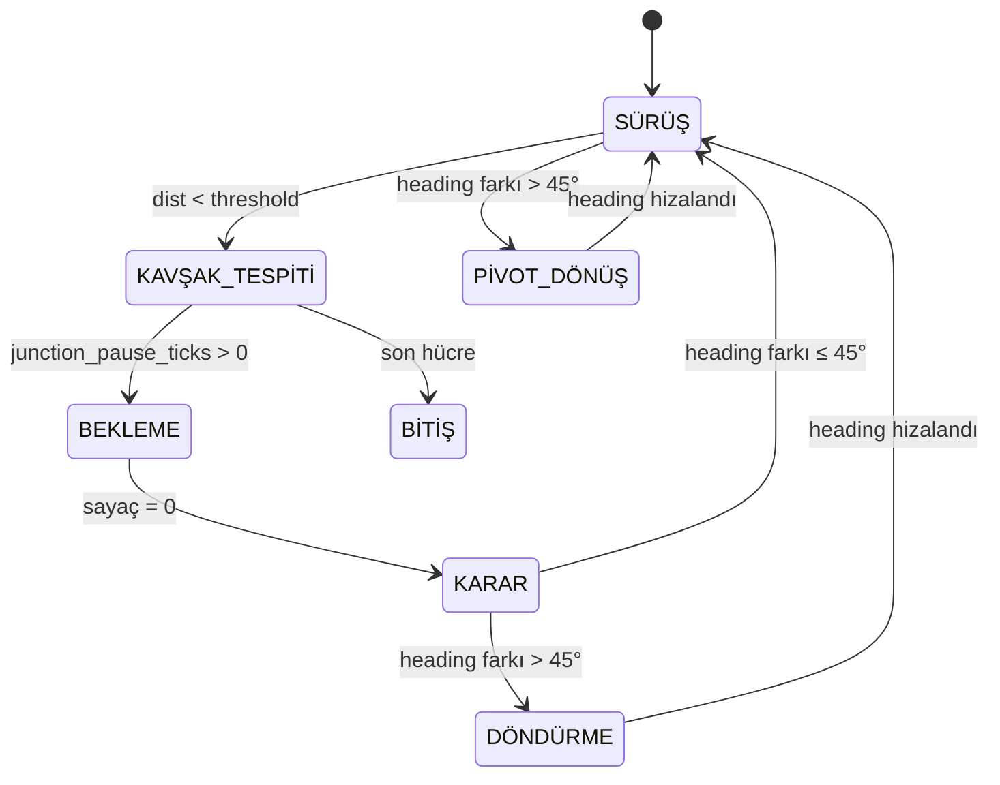

# CARLO Çizgi İzleyen Robot — Teknik Kılavuz (How-To)

Bu doküman, CARLO simülasyonundaki çizgi izleyen labirent robotunun tüm alt sistemlerini, hangi kodun ne işe yaradığını, ve parametreler değiştirildiğinde ne olacağını açıklar.

---

## 📁 Dosya Haritası

| Dosya | Sorumluluk |
|---|---|
| `playground.py` | Ana simülasyon dosyası — tüm ayarlar burada |
| `entities.py` | Fizik motorları — `DiffDriveEntity` (2WD) ve `Entity` (bisiklet) |
| `line_follower.py` | Robot sınıfı — sensörler ve çizgi hata hesaplama |
| `maze_solver.py` | `PathExecutor` (robot kontrolü) + `MazePlanner` (yol planlama) |
| `exploration_strategies.py` | Keşif algoritmaları — sol duvar, sağ duvar, tam keşif |
| `maze_track.py` | Labirent grid → fiziksel dünya dönüşümü |
| `maze_presets.py` | Hazır labirent haritaları |
| `pid_controller.py` | PID kontrolcü (çizgi izleme için) |

---

## 1. Kavşak Tespiti Nasıl Yapılıyor?

Kavşak tespiti **iki katmanda** gerçekleşir:

### Katman 1: Fiziksel Mesafe Kontrolü (PathExecutor)

**Dosya:** [maze_solver.py](file:///c:/Users/kubil/Documents/GitHub/Carlo%20Modified/maze_solver.py#L259-L264)

```python
target_pos = self.maze.cell_to_world(*target_cell)
dx = target_pos.x - self.robot.center.x
dy = target_pos.y - self.robot.center.y
dist = np.sqrt(dx**2 + dy**2)

if dist < self.junction_threshold:   # ← KAVŞAK TESPİTİ
    # Robot hedef hücrenin merkezine yeterince yaklaştı
```

**Mekanizma:** Robot, hedef hücrenin dünya koordinatındaki merkez noktasına olan Öklid mesafesini her `step()` çağrısında hesaplar. Bu mesafe `junction_threshold`'dan küçükse, "kavşağa vardım" kabul edilir.

**Parametre:** `JUNCTION_THRESHOLD` ([playground.py satır 81](file:///c:/Users/kubil/Documents/GitHub/Carlo%20Modified/playground.py#L81))

| Değer | Etki |
|---|---|
| `0.02` | Çok hassas — robot tam merkeze gelmeli, kavşağı kaçırabilir |
| **`0.05`** | **Varsayılan** — dengeli hassasiyet |
| `0.10` | Gevşek — erken algılar, robot henüz kavşak merkezinde değilken durur |
| `> cell_size/2` | **TEHLİKELİ** — bir sonraki kavşağı da algılar, atlama yapar |

### Katman 2: Topolojik Analiz (MazeTrack)

**Dosya:** [maze_track.py](file:///c:/Users/kubil/Documents/GitHub/Carlo%20Modified/maze_track.py#L121-L154)

```python
def get_topology_at(self, r, c):
    # Hücrenin 4 yönündeki komşuları kontrol et
    # Dönüş: {'up': bool, 'down': bool, 'left': bool, 'right': bool, 'type': str}
    # type: 'dead_end', 'straight', 'turn', 'T', 'cross'
```

**Mekanizma:** Grid üzerinde hücrenin 4 yönünde açık yol olup olmadığını kontrol eder. Açık yön sayısına göre hücre tipini belirler:

| Açık Yön Sayısı | Tip | Açıklama |
|---|---|---|
| 0-1 | `dead_end` | Çıkmaz sokak |
| 2 (karşılıklı) | `straight` | Düz yol |
| 2 (köşe) | `turn` | L viraj |
| 3 | `T` | T kavşak |
| 4 | `cross` | Çapraz kavşak |

Bu bilgiyi **keşif stratejileri** kullanır (hangi yöne gidileceğine karar vermek için).

---

## 2. Robot Hareket Döngüsü (State Machine)

`PathExecutor.step()` her simülasyon tick'inde çağrılır. Robot şu durumlar arasında geçiş yapar:



### Durum Detayları

| Durum | Kod Konumu | Robot Ne Yapıyor |
|---|---|---|
| **SÜRÜŞ** | [maze_solver.py:309-337](file:///c:/Users/kubil/Documents/GitHub/Carlo%20Modified/maze_solver.py#L309-L337) | PID ile çizgi izliyor |
| **BEKLEME** | [maze_solver.py:227-242](file:///c:/Users/kubil/Documents/GitHub/Carlo%20Modified/maze_solver.py#L227-L242) | Kavşakta durup bekliyor |
| **PİVOT DÖNÜŞ** | [maze_solver.py:288-303](file:///c:/Users/kubil/Documents/GitHub/Carlo%20Modified/maze_solver.py#L288-L303) | Yerinde dönüyor (2WD) |

---

## 3. 2WD Diferansiyel Sürüş Fiziği

**Dosya:** [entities.py — DiffDriveEntity](file:///c:/Users/kubil/Documents/GitHub/Carlo%20Modified/entities.py#L161-L252)

### Kontrol Arayüzü

```python
robot.set_control(v_left, v_right)  # Sol ve sağ tekerlek hızları (m/s)
```

| v_left | v_right | Hareket |
|---|---|---|
| `0.2` | `0.2` | Düz ileri |
| `0.0` | `0.0` | Dur |
| `-0.08` | `0.08` | Yerinde sola dön |
| `0.08` | `-0.08` | Yerinde sağa dön |
| `0.1` | `0.2` | Sola ark çiz |
| `0.2` | `0.1` | Sağa ark çiz |

### Kinematik Formüller (ICC Tabanlı)

```
v = (v_R + v_L) / 2          → Doğrusal hız
ω = (v_R - v_L) / L          → Açısal hız  (L = track_width = 0.08m)
```

Robot boyutları ([line_follower.py satır 11](file:///c:/Users/kubil/Documents/GitHub/Carlo%20Modified/line_follower.py#L11)):
- **Uzunluk:** 0.15m (`size.x`)
- **Genişlik (track_width):** 0.08m (`size.y`)

---

## 4. Parametre Rehberi — Ne Değiştirirsen Ne Olur?

Tüm parametreler [playground.py](file:///c:/Users/kubil/Documents/GitHub/Carlo%20Modified/playground.py#L66-L83)'nin üst kısmında bulunur.

### 4.1 Hız Parametreleri

#### `BASE_SPEED` (Varsayılan: `0.15`)
Robot düz yoldaki temel hızı (m/s).

| Değer | Sonuç |
|---|---|
| `0.05` | Çok yavaş — güvenli ama simülasyon uzun sürer |
| **`0.15`** | **Önerilen** — L virajlarda çizgiyi kaçırmaz |
| `0.30` | Hızlı — düz yolda iyi, virajlarda çizgi kaybı riski |
| `0.50+` | Tehlikeli — sensörler çizgiyi yakalayamaz, robot kaybolur |

> [!WARNING]
> `BASE_SPEED` arttıkça robot virajlarda çizgiyi kaçırır. Artırıyorsan `SENSOR_SPREAD`'i de artırmalısın (daha geniş sensör dizilimi).

#### `turn_speed` (Varsayılan: `0.08`)
Pivot dönüşündeki tekerlek hızı (m/s). PathExecutor parametresi.

| Değer | Sonuç |
|---|---|
| `0.03` | Yavaş dönüş — hassas ama zaman alır |
| **`0.08`** | **Önerilen** — 90° dönüş ≈ 0.6 saniye |
| `0.15` | Hızlı dönüş — dönüş sonrası overshoot riski |

### 4.2 Sensör Parametreleri

#### `ROBOT_SENSOR_COUNT` (Varsayılan: `8`)
IR sensör sayısı.

| Değer | Sonuç |
|---|---|
| `3` | Minimum — sadece sol/orta/sağ, hassas izleme zor |
| `5` | Makul — temel PID çalışır |
| **`8`** | **Önerilen** — yumuşak çizgi izleme |
| `16` | Lüks — çok hassas, ama hesaplama maliyeti artar |

#### `SENSOR_SPREAD` (Varsayılan: `0.056`)
Sensör diziliminin toplam genişliği (metre).

| Değer | Sonuç |
|---|---|
| `0.02` | Dar — çizgiyi iyi görür ama virajda kaybeder |
| **`0.056`** | **Önerilen** — `LINE_WIDTH=0.03` ile uyumlu |
| `0.10` | Geniş — virajlarda iyi, ama düz yolda tüm sensörler çizgide |

> [!IMPORTANT]
> `SENSOR_SPREAD` ≈ `LINE_WIDTH × 2` civarında olmalı. Çok dar → virajda kayıp. Çok geniş → düz yolda hata sinyali kaybolur.

#### `SENSOR_OFFSET` (Varsayılan: `0.08`)
Sensörlerin robot merkezinden ne kadar önde olduğu (metre).

| Değer | Sonuç |
|---|---|
| `0.03` | Merkeze yakın — geç tepki, virajda iyi |
| **`0.08`** | **Önerilen** — robotun burun ucuna yakın |
| `0.15` | Çok önde — erken tepki ama sensör robotun dışına çıkar |

### 4.3 Çizgi ve Labirent Parametreleri

#### `CELL_SIZE` (Varsayılan: `0.2`)
Labirent hücre boyutu (metre).

| Değer | Sonuç |
|---|---|
| `0.1` | Küçük — dar koridorlar, robot zar zor sığar |
| **`0.2`** | **Önerilen** — robot rahat hareket eder |
| `0.5` | Büyük — geniş alanlar, çizgi arası mesafe fazla |

> [!CAUTION]
> `CELL_SIZE` robotun boyutundan (`0.15m`) küçükse robot çizgiler arasına sığamaz!

#### `LINE_WIDTH` (Varsayılan: `0.03`)
Yerdeki çizginin kalınlığı (metre).

| Değer | Sonuç |
|---|---|
| `0.01` | İnce — sensörler çizgiyi kaçırabilir |
| **`0.03`** | **Önerilen** |
| `0.06` | Kalın — tüm sensörler aynı anda çizgide, hata sinyali kaybolur |

### 4.4 Kavşak Davranış Parametreleri

#### `JUNCTION_PAUSE_TICKS` (Varsayılan: `15`)
Kavşağa varınca kaç simülasyon adımı beklenecek.

| Değer | Sonuç |
|---|---|
| `0` | Durmaz — eski hızlı davranış |
| `10` | 0.5 saniye bekleme (dt=0.05 ile) |
| **`15`** | **Önerilen** — 0.75 saniye, görsel olarak fark edilir |
| `40` | 2 saniye — çok yavaş ama debug için iyi |

#### `JUNCTION_THRESHOLD` (Varsayılan: `0.05`)
Kavşak merkeze varış kabul mesafesi (metre).

| Değer | Sonuç |
|---|---|
| `0.02` | Çok dar — robot tam merkeze gelmeli |
| **`0.05`** | **Önerilen** |
| `0.10` | Geniş — erken tespit, ama robot merkeze varmadan durur |

#### `turn_in_place_threshold` (Varsayılan: `π/4 ≈ 0.785 rad = 45°`)
Bu açıdan büyük heading farkında robot yerinde döner.

| Değer | Sonuç |
|---|---|
| `π/6 (30°)` | Hassas — küçük açılarda bile pivot dönüş, çok duraksar |
| **`π/4 (45°)`** | **Önerilen** — sadece gerçek viraj ve U-turn'lerde pivot |
| `π/2 (90°)` | Sadece 90°+ dönüşlerde pivot, küçük virajlar PID ile |
| `π (180°)` | Asla pivot yapmaz — eski bisiklet modeli davranışı |

### 4.5 PID Kontrolcü Parametreleri

**Dosya:** [pid_controller.py](file:///c:/Users/kubil/Documents/GitHub/Carlo%20Modified/pid_controller.py) veya [playground.py BangBangController](file:///c:/Users/kubil/Documents/GitHub/Carlo%20Modified/playground.py#L33)

PID çıktısı artık **açısal hız (ω, rad/s)** olarak yorumlanıyor.

| Parametre | Etki | Artırınca | Azaltınca |
|---|---|---|---|
| `kp` | Oransal kazanç | Hızlı tepki, salınım riski | Yavaş tepki, çizgiyi geç yakalar |
| `ki` | İntegral kazanç | Kalıcı hatayı düzeltir, rüzgar | Kalıcı sapma kalabilir |
| `kd` | Türev kazanç | Overshoot'u azaltır, gürültüye duyarlı | Salınım artar |

**BangBang vs PID seçimi:**
- `BangBangController` → Basit, hızlı tepki, sürekli salınım (zig-zag)
- `CustomPIDController` → Yumuşak izleme, ayar gerektirir

---

## 5. Keşif Algoritmaları

**Dosya:** [exploration_strategies.py](file:///c:/Users/kubil/Documents/GitHub/Carlo%20Modified/exploration_strategies.py)

Seçim: [playground.py satır 29](file:///c:/Users/kubil/Documents/GitHub/Carlo%20Modified/playground.py#L29)
```python
EXPLORATION_STRATEGY = 'full_explore'   # ← bunu değiştir
```

### 5.1 Sol Duvar Takibi (`'left_wall'`)

| Özellik | Detay |
|---|---|
| **Mantık** | Sol elini duvara koy, sürekli sola dönmeye çalış |
| **Biter** | Bitiş noktasını bulunca |
| **Faz 2 Rotası** | Keşfedilen kısmi harita üzerinde BFS |
| **Avantaj** | Hızlı — en kısa sürede bitişe ulaşır |
| **Dezavantaj** | Haritanın tamamını görmez, optimal yolu bulamayabilir |
| **Çıkmaz Sokak** | Sol-el kuralı otomatik halleder (geri = son seçenek) |

### 5.2 Sağ Duvar Takibi (`'right_wall'`)

Sol duvar takibinin ayna simetrisi. Farklı bir yol bulabilir.

### 5.3 Tam Keşif + BFS (`'full_explore'`)

| Özellik | Detay |
|---|---|
| **Mantık** | Tüm haritayı tara, hiç ziyaret edilmemiş hücre kalmasın |
| **Biter** | Tüm erişilebilir hücreler ziyaret edilince |
| **Faz 2 Rotası** | Tam harita üzerinde BFS → **garantili en kısa yol** |
| **Avantaj** | Optimal çözüm |
| **Dezavantaj** | Yavaş — tüm haritayı gezmesi gerekir |
| **Geri Dönüş** | BFS ile en yakın keşfedilmemiş hücreye geri döner |

### Yeni Strateji Ekleme

[exploration_strategies.py](file:///c:/Users/kubil/Documents/GitHub/Carlo%20Modified/exploration_strategies.py)'de:

```python
class MyStrategy(BaseExplorer):
    @property
    def name(self):
        return "Benim Stratejim"

    def decide_next(self, current_cell):
        neighbors = self._discover_cell(current_cell)
        # ... karar mantığı ...
        return next_cell  # veya None (keşif bitti)

# STRATEGIES dict'ine ekle:
STRATEGIES['my_strategy'] = MyStrategy
```

---

## 6. Çıkmaz Sokak Mekanizması

### Tespit

**Dosya:** [playground.py](file:///c:/Users/kubil/Documents/GitHub/Carlo%20Modified/playground.py#L155-L161)

```python
neighbors = strategy.internal_graph.get(cell, [])
if len(neighbors) == 1:
    print("✗ ÇIKMAZ SOKAK! Geri dönüyorum...")
```

**Ek olarak:** [maze_track.py get_topology_at()](file:///c:/Users/kubil/Documents/GitHub/Carlo%20Modified/maze_track.py#L142) → `type='dead_end'`

### Fiziksel Geri Dönüş

1. Robot çıkmaz sokağın sonuna varır
2. `junction_pause_ticks` kadar bekler
3. Strateji geri hücreyi döndürür (sol-el kuralında "geri" = son seçenek)
4. Heading farkı ~180° → **pivot dönüş** tetiklenir
5. Robot yerinde 180° döner (v_L = -0.08, v_R = +0.08)
6. Döndükten sonra PID ile çizgiyi bulur ve geri gider
7. Önceki kavşağa varır → strateji bir sonraki seçeneği dener

---

## 7. Labirent Grid Formatı

**Dosya:** [maze_presets.py](file:///c:/Users/kubil/Documents/GitHub/Carlo%20Modified/maze_presets.py)

```python
MAZE = np.array([
    [0, 0, 0, 0, 0],
    [0, 3, 1, 1, 0],    # 3 = bitiş
    [0, 0, 0, 1, 0],
    [0, 0, 0, 1, 0],
    [0, 0, 0, 2, 0],    # 2 = başlangıç
])
```

| Değer | Anlamı |
|---|---|
| `0` | Duvar (boşluk) |
| `1` | Yol |
| `2` | Başlangıç noktası (yeşil) |
| `3` | Bitiş noktası (kırmızı) |

> [!NOTE]
> Grid'de `(0,0)` **sol üst köşe**, ama dünya koordinatında **sol alt** köşeye karşılık gelir (`y` ekseni ters).

### Mevcut Haritalar

| İsim | Boyut | Zorluk |
|---|---|---|
| `MAZE_SIMPLE_L` | 5×5 | Tek L viraj |
| `MAZE_SIMPLE_S` | 6×6 | S şekli |
| `MAZE_MEDIUM_T` | 7×7 | T kavşak |
| `MAZE_MEDIUM_LOOP` | 8×8 | Döngülü (birden fazla yol) |
| `MAZE_HARD_DEADENDS` | 10×9 | Çıkmaz sokaklı |
| `MAZE_EXPERT` | 11×11 | Büyük karmaşık labirent |
| `MAZE_MineOne` | 22×11 | Geniş alan |
| `MAZE_30x30` | 30×30 | En büyük harita |

---

## 8. Hızlı Başlangıç — Tipik Senaryolar

### Senaryo 1: Basit test — sol duvar takibi
```python
EXPLORATION_STRATEGY = 'left_wall'
MAZE_GRID = MAZE_SIMPLE_L
BASE_SPEED = 0.15
JUNCTION_PAUSE_TICKS = 15
```

### Senaryo 2: Optimal çözüm arama
```python
EXPLORATION_STRATEGY = 'full_explore'
MAZE_GRID = MAZE_EXPERT
BASE_SPEED = 0.15
JUNCTION_PAUSE_TICKS = 15
```

### Senaryo 3: Hız testi (deneyimli kullanıcı)
```python
EXPLORATION_STRATEGY = 'left_wall'
MAZE_GRID = MAZE_HARD_DEADENDS
BASE_SPEED = 0.30
JUNCTION_PAUSE_TICKS = 0
SENSOR_SPREAD = 0.08     # Hız için daha geniş sensör
```

### Senaryo 4: Debug modu
```python
JUNCTION_PAUSE_TICKS = 40   # Her kavşakta 2 saniye dur
BASE_SPEED = 0.05           # Çok yavaş
SIM_DT = 0.02               # Daha hassas simülasyon
```
